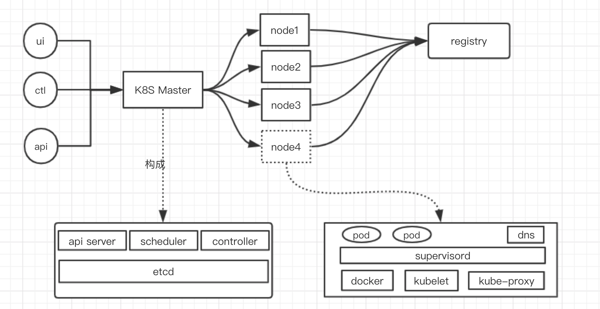

# Kerbernets

## 容器编排系统
* 服务注册、服务发现
* 动态负载均衡
* 自动扩容缩容
* 自动停止、启动、0宕机

## 架构设计图

## 组件名称
### Master节点
* kube-apiserver
* kube-scheduler
* kube-controller-manager
* cloud-controller-manager
* etcd

### Node节点
* kubelet
* docker
* kube-proxy
* network plugin（flanel、clico）
* dns

### service网络
> 10.96.0.0/26

### Pod网络插件
* flanel
> 10.244.0.0/16

* calico
> 192.168.0.0/16

