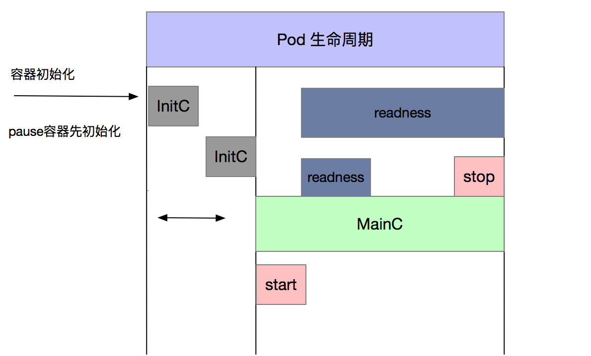

## pod生命周期

### pod生命周期图示



### 容器状态
* p

### init容器
- initC.yaml
```
apiVersion: v1
kind: Pod
metadata:
  name: init-c-pod
  labels:
    app: myapp
    version: v1

spec:
  containers:
  - name: myapp-c1
    image: harbor.test.com/library/myapp:v1
    command: ["sh", "-c", "echo the myapp-c1 running && sleep 3600"]
  initContainers:
  - name: init-1
    image: harbor.test.com/library/busybox:v1
    command: ["sh", "-c", "touch /tmp/a.txt && sleep 60"]

  - name: init-2
    image: harbor.test.com/library/busybox:v1
    command: ["sh", "-c", "echo init-2 running && sleep 2"]

```
- 起初状态
```
[root@k8sNode1 ~]# kubectl  get pod
NAME         READY   STATUS     RESTARTS   AGE
init-c-pod   0/1     Init:0/2   0
```

- 后期状态
```
^C[root@k8sNode1 ~]# kubectl  get pod 
NAME         READY   STATUS    RESTARTS   AGE
init-c-pod   1/1     Running   0          79s
```

